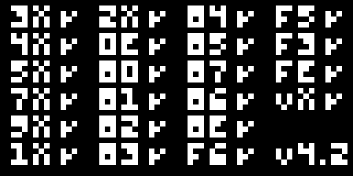
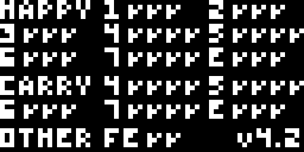

# Retro

A CHIP-8 interpreter implemented in Rust, with SDL2 for display, input, and audio. It implements the complete CHIP-8 instruction set and a configurable quirks layer covering the behavioral differences between the original COSMAC VIP interpreter and the CHIP-48/SUPER-CHIP variant.

## Demo

[Pong running in the interpreter](docs/videos/pong.mp4)

## Correctness

Correctness was verified against the [Timendus CHIP-8 test suite](https://github.com/Timendus/chip8-test-suite), specifically the `Corax+` opcode test and the `Flags` carry/borrow/shift test. Both ROMs write a pass or fail indicator per sub-check; execution was traced with the snapshot tool described below and cross-referenced against the ROM disassembly to confirm the meaning of each indicator address. Both report zero failures under the CHIP-48 quirk preset (22/22 and 47/47 checks, respectively), and this is pinned as a regression test in `tests/suite.rs`.

`5-Quirks.ch8` and `6-Keypad.ch8` are menu-driven and require interactive key selection before running, so their results are not captured as automated regression tests. Both were verified manually by running the ROM directly, and all checks pass.

| ROM | Result |
|---|---|
| `IBM Logo.ch8` | Renders correctly |
| `Corax+.ch8` | 22/22 checks pass |
| `Flags.ch8` | 47/47 checks pass |
| `5-Quirks.ch8` | All checks pass (verified manually) |
| `6-Keypad.ch8` | All checks pass (verified manually) |

<p>
  
  
  
</p>

## Architecture

The emulation core (`src/chip8/`) is a plain library crate with no OS-level dependencies, which allows it to run headlessly under tests, benchmarks, and the snapshot tool. Only `src/main.rs`, the SDL2 platform layer, touches a window, an audio device, or the filesystem beyond loading a ROM.

```
src/lib.rs               crate root, re-exports the public API
src/config.rs            config.toml to Quirks, exe-relative path resolution
src/chip8/mod.rs         Chip8 struct, fetch/decode/tick, public API
src/chip8/opcodes.rs     instruction implementations and unit tests
src/chip8/quirks.rs      Quirks / Platform, the ambiguous-instruction config
src/chip8/font.rs        built-in hex digit sprites
src/audio.rs             beep playback, decoded once rather than per tick
src/input.rs             keyboard scancode to CHIP-8 key mapping
src/main.rs              SDL2 window, event loop, timing
src/bin/snapshot.rs      headless tool: ROM to PNG, or opcode trace

tests/suite.rs           integration tests against roms/*.ch8
benches/                 Criterion benchmarks
```

The snapshot tool (`cargo run --bin snapshot`) runs a ROM for a fixed number of cycles with no display or audio device attached and writes the resulting display buffer to a PNG, or traces executed opcodes and register state to stderr. It accepts scripted key input to advance past a ROM's own menus. It was used throughout development in place of visual inspection of the SDL window.

## Configurable quirks

`config.toml` selects which interpreter's behavior to emulate for instructions the original specification leaves ambiguous:

```toml
version = "CHIP-48"   # or "CHIP-8"
```

| Quirk | CHIP-8 | CHIP-48 |
|---|---|---|
| `8XY6` / `8XYE` shift source | VY | VX |
| `BNNN` jump with offset | `NNN + V0` | `NNN + VX` |
| `FX55` / `FX65` memory ops | increments `I` | leaves `I` unchanged |
| `8XY1` / `8XY2` / `8XY3` logic ops | resets `VF` to 0 | leaves `VF` unchanged |

## Performance

Measured with `cargo bench` (Criterion):

- `tick()` throughput: approximately 81 microseconds per 10,000 emulated instructions across a representative instruction mix, or roughly 123M instructions per second. A CHIP-8 program executes at approximately 700 instructions per second, so the interpreter is not the limiting factor in the frame loop.
- The prior implementation re-opened and re-decoded `beep.wav` on every tick the sound timer was active, at up to 60 calls per second. That path measured 236 microseconds per call. The current implementation decodes the file once at startup and clones a cached sample buffer per tick, at 0.58 microseconds per call.

## Controls

```
Keyboard          CHIP-8 keypad
1 2 3 4           1 2 3 C
Q W E R           4 5 6 D
A S D F           7 8 9 E
Z X C V           A 0 B F
```

## Building and running

Requires the SDL2 development libraries to link; see the [rust-sdl2](https://github.com/Rust-SDL2/rust-sdl2) setup instructions for the target platform. On Windows, `build.rs` copies `config.toml`, `beep.wav`, and the vendored `SDL2.dll` next to the built executable automatically, so no manual setup is needed beyond that.

```sh
cargo run --release                       # runs roms/5-Quirks.ch8 by default
cargo run --release -- roms/Pong.rom      # or a given ROM path

cargo test
cargo bench

cargo run --bin snapshot -- roms/Corax+.ch8 400 out.png
cargo run --bin snapshot -- roms/5-Quirks.ch8 800 out.png --trace-from=0 --tap=390:2:60
```

## License

[MIT](LICENSE)
